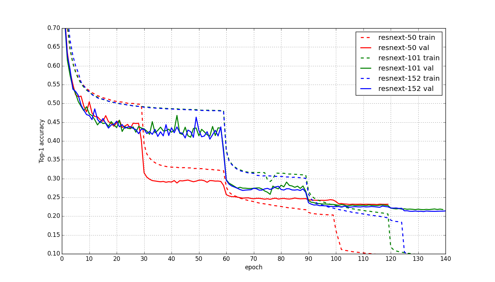

# ResNeXt
Reproduce ResNet-v3(Aggregated Residual Transformations for Deep Neural Network)

### Results

0. 1-crop validation error on ImageNet (center 224x224 crop from resized image with shorter side=256):

	model|top-1|top-5
	:---:|:---:|:---:
	[VGG-16](http://www.vlfeat.org/matconvnet/pretrained/)|[28.5%](http://www.vlfeat.org/matconvnet/pretrained/)|[9.9%](http://www.vlfeat.org/matconvnet/pretrained/)
	ResNet-50|24.7%|7.8%
	**ResNeXt-50**|**23.1**%|**6.7**%
	ResNet-101|23.6%|7.1%
	**ResNeXt-101(32x4d)**|**22.1**%|**5.8**%
	ResNet-152|23.0%|6.7%
	**ResNeXt-152**|**21.3**%|**5.6**%
	**ResNeXt-101(64x4d)**|**20.8**%|**5.5**%
	
        
	
1. 1-crop validation error on ImageNet (center 320x320 crop from resized image with shorter side=320):

| Network    |crop-size | top-1 |  top-5 |
| :------:   | :---: | :---: |:---: |
|ResNet-152-v1  | 320x320 |21.3%|5.5%|
|ResNet-152-v2  | 320x320 |21.1%|5.5%|
|ResNet-200-v1  | 320x320 |21.8%|6.0%|
|ResNet-200-v2  | 320x320 |20.7%|5.3%|
|**ResNeXt-50**    | 320x320 |**21.9**%|**5.9**%|
|**ResNeXt-101(32x4d)**    | 320x320 |**20.2**%|**4.9**%|
|**ResNeXt-152**    | 320x320 |**19.9**%|**4.8**%|
|**ResNeXt-101(64x4d)**    | 320x320 |**19.7**%|**4.8**%|

### Training Curve:

  

### Model files:

   ResNeXt-50 OneDrive download: [link](https://1drv.ms/u/s!Aqd-q_R495Lrjg3NE0LxvH-7R81B)
   
   ResNeXt-101 OneDrive download: [link](https://1drv.ms/u/s!Aqd-q_R495LrjgyQx2cKLOXKEQgN)
   
   ResNeXt-152 OneDrive download: [link](https://1drv.ms/u/s!Aqd-q_R495Lrjk2kN1ebw77WkyZN)
